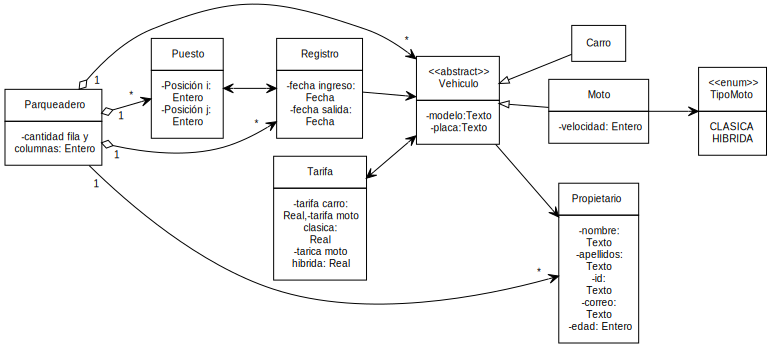

<h1 style="color: gray">Programación Orientada a Objetos</h1>

<h5 style="color: gray">Área de programación 
Programa de Ingeniería de Sistemas y Computación 
Facultad de Ingeniería
</h5>

<b>
Problema proyecto final:  
Administración de un Parqueadero 
</b>

---

Se desea desarrollar una aplicación para la administración eficiente de un parqueadero. El
parqueadero cuenta con un número n de puestos, cada uno identificado por una posición
única (i, j). Cada puesto puede estar ocupado por un vehículo, que puede ser de tipo moto
(clásica o híbrida) o carro, y debe tener una placa, un modelo y un propietario registrado en el
sistema.
Para las motos, se debe registrar también su velocidad máxima, ya que el parqueadero es
frecuentado por compradores de motos usadas interesados en conocer este dato. Un vehículo
solo puede ocupar un puesto a la vez, por lo que se debe verificar la disponibilidad del puesto
antes de ubicar un vehículo en él.
El sistema debe llevar un registro completo de todos los vehículos que han parqueado en el
establecimiento, incluyendo información sobre el puesto ocupado y el momento de ingreso.
Además, debe permitir la identificación del propietario de un vehículo ubicado en un puesto.

---

Sistema que permita :

● El sistema debe permitir la creación de un parqueadero con un número de puestos.
● Cada puesto debe tener una posición (i, j) y puede estar ocupado por un vehículo.
● Un vehículo puede ser de tipo moto (clásica o híbrida) o carro, y debe tener una placa,
un modelo y un propietario.
● Si el vehículo es una moto, se debe registrar su velocidad máxima.
● El sistema debe permitir verificar si un puesto está ocupado por un vehículo y si un
puesto está disponible.
● El sistema debe llevar un registro de todos los vehículos que han parqueado en el
parqueadero.
● Se debe poder identificar al propietario de un vehículo ubicado en un puesto dado.

---

● El sistema debe llevar un registro de todos los ingresos al parqueadero, incluyendo el
puesto ocupado y el vehículo ubicado en el mismo.

● Un puesto solo puede estar ocupado por un vehículo a la vez.
● Un vehículo solo puede ocupar un puesto en un momento dado.
● Para que un vehículo se ubique en un puesto, el puesto debe estar vacío.
● Se debe establecer una tarifa por hora de uso del parqueadero para cada tipo de
vehículo (moto clásica, moto híbrida y carro).
● El sistema debe calcular el costo total de estacionamiento de un vehículo basado en el
tiempo de uso y la tarifa por hora correspondiente a su tipo.

---

● Se debe permitir que el administrador del parqueadero pueda configurar las tarifas por
hora para cada tipo de vehículo.

● El sistema debe ser capaz de generar un reporte diario y mensual del dinero recaudado
en el parqueadero.
● El reporte diario debe incluir el total recaudado en ese día, desglosado por tipo de
vehículo (moto clásica, moto híbrida, carro).

---

- **Parqueadero**:
  - cantidad filas: Entero
  - cantidad columnas: Entero

- **Puesto**:
  - posicion i: Entero
  - posicion j: Entero 

- **Vehiculo**:
  - Modelo: Texto
  - Placa: Texto
---

- **Carro**:
  - modelo: Texto
  - Placa: Texto
  - tarifa: Real

- **Moto**:
  - modelo: Texto
  - Placa: Texto
  - Velocidad: Entero
  - tarifa: Real

- **Tarifa**
  - tarifa de carro: Real
  - tarifa de moto clasica: Real
  - tarifa de moto hibrida: Real
---

- **Propietario**:
  - nombre: Texto
  - apellido: Texto
  - numero identificación: Texto
  - correo: Texto
  - numero celular: Texto
  - edad: Entero

- **Registro**:
  - fecha ingreso: Fecha
  - fecha salida: Fecha

---

---

- **Parqueadero**
  - crear un parqueadero
  - Agregar un vehículo al parqueadero
  - Recuperar el nombre de un propietario a partir de la búsqueda de un vehículo
  - Generar un reporte diario de los costos del parqueadero desglosado por cada costo generado por vehículo
  - Generar un reporte mensual de los costos generados del parqueadero
  - Calcular el valor a pagar por el servicio de parqueadero

- **Registro**
  - calcular el valor por duración de aparcamiento de los vehiculos

---

- **Puesto**
  - verificar la disponibilidad de un puesto

- **Tarifa**
  - calcular el valor individual de cada vehiculo 

  
---

---

- Almacenar datos de prueba
- Recuperar los datos de prueba
- Verificar que los datos almacenados coinciden con los datos recuperados

---

Clase: **Propietario**

| Prueba                                | Entrada de datos                                          | Salida (Resultado)                                                                                  |
|---------------------------------------|-----------------------------------------------------------|-----------------------------------------------------------------------------------------------------|
| Datos Completos | propietario("julian", "gutierrez", "1004915388", "jugutier@gmail.com", "3124874139", 51)|Propietario creado Propietario("julian", "gutierrez", "1004915388", "jugutier@gmail.com", "3124874139", 51) |
| Con datos nulos | Propietario(null,null,null,null,null, 51) | Error, faltan datos para la creación del propietario |
| Datos vacíos | Propietario("", "", "1004915388", "jugutier@gmail.com", "", 51)| Error, faltan datos para la creación del propietario |
| Edad negativa | Propietario("julian", "gutierrez", "1004915388", "jugutier@gmail.com", "3124874139", -51) |Error, la edad no pueden ser negativos                      |
| Correo inválido | Propietario("julian", "gutierrez", "1004915388", "jugutier", "3124874139", 51)  | Error, el correo del propietario es invalido         |

Clase: **Puesto**

| Prueba                                | Entrada de datos                                          | Salida (Resultado)                                                                                  |
|---------------------------------------|-----------------------------------------------------------|-----------------------------------------------------------------------------------------------------|
| Datos completos | Se crea un puesto correcto (2, 2)       | Puesto creado (2,2) |
| Datos negativos | Se crea un puesto incorrecto  (-2,-2)      | Error, no se puede crear un puesto con valores negativos  |
|

---

Clase: **Parqueadero**

| Prueba                                | Entrada de datos                                          | Salida (Resultado)                                                                                  |
|---------------------------------------|-----------------------------------------------------------|-----------------------------------------------------------------------------------------------------|
| Verificar disponibilidad | Se creo un puesto (1,1) y se verifica su diponibilidad| Se obtiene un puesto ocupado o un puesto vacío |
| Ubicar vehiculo | Se crea un puesto, un propietario y un vehiculo y se le asigna| Se obtiene un vehiculo ubicado |
| Identificar propietario | Se crea un propietario, un vehiculo y se ubica en un puesto, luego se pregunta por el nombre del carro parqueado| Se obtiene el nombre del propietario |
| Liberar puesto | Se crea un vehiculo y se ubica en un puesto, para poder retirarlo| Se obtiene un puesto libre  |
| Generar reporte diario | Se crean los tres tipos de vehiculo y se ubican en el parqueadero, luego se retiran y se genera el registro diario  | Se obtiene un registro con los tres vehiculos ingresados |

---

Clase: **Parqueadero**

| Prueba                                | Entrada de datos                                          | Salida (Resultado)                                                                                  |
|---------------------------------------|-----------------------------------------------------------|-----------------------------------------------------------------------------------------------------|
| Generar reporte mensual | Se crean los tres tipos de vehiculos y se ubican en el parqueadero para posteriormente retirarlos| se genera un reporte en el lapso de un mes donde debe aparecer los tres vehiculos parqueados |
| Datos negativos | Se intenta crear un parqueadero con valor negativo (-1)| Error, no es posible crear un parqueadero con un valor negativo |

---

Clase: **Moto**

| Prueba                                | Entrada de datos                                          | Salida (Resultado)                                                                                  |
|---------------------------------------|-----------------------------------------------------------|-----------------------------------------------------------------------------------------------------|
| Datos completos | Se crea una moto ("def456", "kawasaki", propietario, TipoMoto."", 200.0)|  Se obtiene ("def456", "kawasaki", propietario, TipoMoto."", 200.0)|
| Datos negativos | Se crea una moto ("def456", "kawasaki", propietario, TipoMoto."", -200.0) | Error, no es posible crear na moto con verocidad negativa |

Clase: **carro**
| Prueba                                | Entrada de datos                                          | Salida (Resultado)                                                                                  |
|---------------------------------------|-----------------------------------------------------------|-----------------------------------------------------------------------------------------------------|
| Datos completos | Se crea un carro ("abc123", "chevrolet", propietario) | Se obtiene ("abc123", "chevrolet", propietario)
| Datos null | se crea un carro (null, null, null) | Error, no es posible crear un carro con datos nulos |

---

 - Se reutilizar las pruebas hechas para estudiante en el problema 01 del programa de programación 1 

---

- **¿Cómo pruebo la solución?**

  - Almacenar datos de prueba de un estudiante. 
  - Recuperar datos de prueba de un estudiante. 
  - Verificar que los datos almacenados coinciden con los datos recuperados

---

<!-- 
_header: ''
_footer: '' 
_paginate: false
_backgroundImage: url('imagenes/gracias.png')
-->
