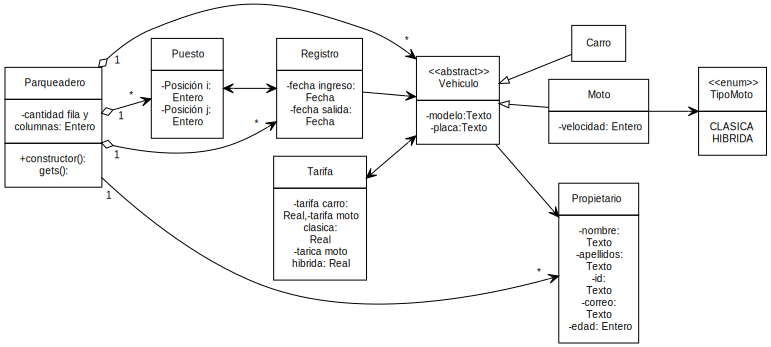

<h1 style="color: gray">Programación Orientada a Objetos</h1>

<h5 style="color: gray">Área de programación 
Programa de Ingeniería de Sistemas y Computación 
Facultad de Ingeniería
</h5>

<b>
Problema proyecto final:  
Administración de un Parqueadero 
</b>

---

Se desea desarrollar una aplicación para la administración eficiente de un parqueadero. El
parqueadero cuenta con un número n de puestos, cada uno identificado por una posición
única (i, j). Cada puesto puede estar ocupado por un vehículo, que puede ser de tipo moto
(clásica o híbrida) o carro, y debe tener una placa, un modelo y un propietario registrado en el
sistema.
Para las motos, se debe registrar también su velocidad máxima, ya que el parqueadero es
frecuentado por compradores de motos usadas interesados en conocer este dato. Un vehículo
solo puede ocupar un puesto a la vez, por lo que se debe verificar la disponibilidad del puesto
antes de ubicar un vehículo en él.
El sistema debe llevar un registro completo de todos los vehículos que han parqueado en el
establecimiento, incluyendo información sobre el puesto ocupado y el momento de ingreso.
Además, debe permitir la identificación del propietario de un vehículo ubicado en un puesto.

---

Sistema que permita :

● El sistema debe permitir la creación de un parqueadero con un número de puestos.
● Cada puesto debe tener una posición (i, j) y puede estar ocupado por un vehículo.
● Un vehículo puede ser de tipo moto (clásica o híbrida) o carro, y debe tener una placa,
un modelo y un propietario.
● Si el vehículo es una moto, se debe registrar su velocidad máxima.
● El sistema debe permitir verificar si un puesto está ocupado por un vehículo y si un
puesto está disponible.
● El sistema debe llevar un registro de todos los vehículos que han parqueado en el
parqueadero.
● Se debe poder identificar al propietario de un vehículo ubicado en un puesto dado.

---

● El sistema debe llevar un registro de todos los ingresos al parqueadero, incluyendo el
puesto ocupado y el vehículo ubicado en el mismo.

● Un puesto solo puede estar ocupado por un vehículo a la vez.
● Un vehículo solo puede ocupar un puesto en un momento dado.
● Para que un vehículo se ubique en un puesto, el puesto debe estar vacío.
● Se debe establecer una tarifa por hora de uso del parqueadero para cada tipo de
vehículo (moto clásica, moto híbrida y carro).
● El sistema debe calcular el costo total de estacionamiento de un vehículo basado en el
tiempo de uso y la tarifa por hora correspondiente a su tipo.

---

● Se debe permitir que el administrador del parqueadero pueda configurar las tarifas por
hora para cada tipo de vehículo.

● El sistema debe ser capaz de generar un reporte diario y mensual del dinero recaudado
en el parqueadero.
● El reporte diario debe incluir el total recaudado en ese día, desglosado por tipo de
vehículo (moto clásica, moto híbrida, carro).

---

- **Parqueadero**:
  - nombre: Texto
  - cantidad filas: Entero
  - cantidad columnas: Entero
  - hashTable: Tabla Hash

- **Puesto**:
  - posicion: Texto

- **Estado de un puesto**:
  - OCUPADO
  - LIBRE

- **Vehiculo**:
  - Modelo: Texto
  - Placa: Texto
---

- **Carro**:
  - modelo: Texto
  - Placa: Texto

- **Moto**:
  - modelo: Texto
  - Placa: Texto
  - Velocidad: Entero

- **PRECIO**:
  - CARRO (3.000)
  - CLÁSICA (2.500)
  - HÍBRIDA (2.700)
---

- **Propietario**:
  - nombre: Texto
  - apellido: Texto
  - numero identificación: Texto
  - correo: Texto
  - numero celular: Texto
  - edad: Entero

- **Registro**:
  - fecha ingreso: Fecha
  - fecha salida: Fecha

---

---

- **ProyectoGobernacion**
  - Almacenar un parque
  - Recuperarla información de un parque dado el nombre
  - Obtener parques de los municipios
  - Obtener parques ordenados por valor ascendente
  - Calcular el valor de todo el proyecto

- **ParqueInfantil**
  - Obtener la información del parque (nombre y descripción)
  - Adicionar / Recuperar zona del parque
  - Calcular el valor del parque

---

- **ZonaParque**
  - Obtener la información de la zona (nombre y material)
  - Calcular el valor de la zona

- **FiguraGeométrica** (**Circulo**, **Rectangulo**, **Cuadradro** y **TruanguloRectangulo**)
  - Calcular área de la figura específica
  
---

---

- Almacenar datos de prueba
- Recuperar los datos de prueba
- Verificar que los datos almacenados coinciden con los datos recuperados

---

Clase: **Registro**

| Prueba                                | Entrada de datos                                          | Salida (Resultado)                                                                                  |
|---------------------------------------|-----------------------------------------------------------|-----------------------------------------------------------------------------------------------------|
| Datos completos  | Se crea un círculo de radio 10 y se obtiene su área| Se obtiene un área de 314.159 |
| Listado semanal | Se intenta crea un círculo de radio -10 y se obtiene su área| Error, no es posible crear un círculo de radio negativo |
| Listado mensual |  |  |
| Datos negativos |  |  |
| Obtener el puesto de un vehículo | | |

Clase: **Parqueadero**

| Prueba                                | Entrada de datos                                          | Salida (Resultado)                                                                                  |
|---------------------------------------|-----------------------------------------------------------|-----------------------------------------------------------------------------------------------------|
| Datos completos | Se crea un rectángulo con ancho 10 y alto 20, luego se obtiene su área| Se obtiene un área de 200.0 |
| Creación del parqueadero | Se intenta crea un rectángulo con ancho -10 y alto 20, luego se obtiene su área| Error, no se puede crear un rectángulo con un ancho negativo |
| Conocer el propietario por la busca de un vehículo | Se intenta crea un rectángulo con ancho 10 y alto -20, luego se obtiene su área| Error, no se puede crear un rectángulo con un alto negativo |

---

Clase: **Cuadrado**

| Prueba                                | Entrada de datos                                          | Salida (Resultado)                                                                                  |
|---------------------------------------|-----------------------------------------------------------|-----------------------------------------------------------------------------------------------------|
| Área de un cuadrado de lado positivo | Se crea un cuadrado de lado 10, luego se obtiene su área| Se obtiene un área de 100.0 |
| Área de un cuadrado de lado negativo | Se intenta crea un cuadrado de lado -10, luego se obtiene su área| Error, no se puede crear un cuadrado con lado negativo |

Clase: **TrianguloRectangulo**

| Prueba                                | Entrada de datos                                          | Salida (Resultado)                                                                                  |
|---------------------------------------|-----------------------------------------------------------|-----------------------------------------------------------------------------------------------------|
| Área de un triángulo rectángulo de base y altura positivas | Se crea un triángulo rectángulo con base 10 y altura 20, luego se obtiene su área| Se obtiene un área de 100.0 |
| Área de un triángulo rectángulo de base negativo y altura positivo | Se intenta crea un triángulo rectángulo con base -10 y altura 20, luego se obtiene su área| Error, no se puede crear un triángulo rectángulo con una base  negativa |
| Área de un triángulo rectángulo de base positiva y altura negativa | Se intenta crea un triángulo rectángulo con base 10 y altura -20, luego se obtiene su área| Error, no se puede crear un triángulo rectángulo de altura negativa  negativa |

---

Clase: **ZonaParque**

| Prueba                                | Entrada de datos                                          | Salida (Resultado)                                                                                  |
|---------------------------------------|-----------------------------------------------------------|-----------------------------------------------------------------------------------------------------|
| Valor de una zona circular en arena | Se crea una zona circular de radio 10 en material de area con nombre "Zona 1" y se obtiene su valor| Se obtiene un valor de 3141592.65 |
| Valor de una zona rectangular en grama sintética | Se crea una zona  rectangular con ancho 10 y alto 20 y de material de grama sintética con nombre "Zona 1", luego se obtiene su valor| Se obtiene un área de 7000000.0 |
| Valor de una zona cuadrada en grama natural | Se crea una zona cuadrada con lado de 10 y de material de grama natural con nombre "Zona 1", luego se obtiene su valor| Se obtiene un área de 2000000.0 |
| Valor de una zona en forma de triángulo rectángulo en asfalto | Se crea una zona en forma de triángulo rectángulo con base de 10 y altura 20, además en material de asfalto con nombre "Zona 1", luego se obtiene su valor| Se obtiene un área de 4000000.0 |

---

Clase: **ParqueInfantil**

| Prueba                                | Entrada de datos                                          | Salida (Resultado)                                                                                  |
|---------------------------------------|-----------------------------------------------------------|-----------------------------------------------------------------------------------------------------|
| Parque infantil con nombre nulo | Se intenta crear un parque infantil con nombre nulo| Error, no se puede crear un parque infantil de nombre nulo |
| Parque infantil con nombre vacío | Se intenta crear un parque infantil con nombre vacío| Error, no se puede crear un parque infantil de nombre vacío |
| Parque infantil con descripción nula | Se intenta crear un parque infantil con descripción nula| Error, no se puede crear un parque infantil con  descripción nula |
| Parque infantil con descripción vacía | Se intenta crear un parque infantil con descripción vacía| Error, no se puede crear un parque infantil con descripción vacía |
| Valor de un parque infantil con datos válidos pero sin zonas | Se crea un parque infantil ( "Mi primer recuerdo", "Parque para los primero años de edad", Calarca ), luego se obtiene el valor del parque |  Se obtiene 10000.0  (sobrecosto)|

---

Clase: **ParqueInfantil**

| Prueba                                | Entrada de datos                                          | Salida (Resultado)                                                                                  |
|---------------------------------------|-----------------------------------------------------------|-----------------------------------------------------------------------------------------------------|
| Valor de un parque infantil con datos válidos y una zona circular | Se crea un parque infantil ( "Mi primer recuerdo", "Parque para los primero años de edad", Calarca ), luego se le adiciona una zona circular de radio 10 en material de arena y de nombre "Zona de mascotas", luego se obtiene el valor del parque |  Se obtiene 3151592.65 |
| Valor de un parque infantil con datos válidos y cuatro zonas una por cada forma | Se crea un parque infantil ( "Mi primer recuerdo", "Parque para los primero años de edad", Calarca ), luego se le adiciona: una zona circular de radio 10 en material de area y de nombre "Zona de mascotas", una zona  rectangular con ancho 10 y alto 20 y de material de grama sintética, zona cuadrada con lado de 10 y de material de grama natural, zona en forma de triángulo rectángulo con base de 10 y altura 20, además en material de arena; finalmente se obtiene el valor del parque | Se obtiene 13151592.65 |
| Parque infantil con dos zonas con el mismo nombre | Se crea un parque infantil ( "Mi primer recuerdo", "Parque para los primero años de edad", Calarca ), luego se le adiciona una zona circular de radio 10 en material de area y de nombre "Zona de mascotas", luego intenta adicionar otra zona (independiente de la forma) con el mismo nombre | Error, no se pueden tener dos zonas con el mismo nombre  |

---

Clase: **ProyectoGobernacion**

| Prueba                                | Entrada de datos                                          | Salida (Resultado)                                                                                  |
|---------------------------------------|-----------------------------------------------------------|-----------------------------------------------------------------------------------------------------|
| Valor de proyecto que no tiene parques | Se crea un proyecto de la gobernación sin parques, luego se solicita el valor del proyecto | Se obtiene 0.0|
| Se obtiene un parque por el nombre | Se adiciona al proyecto de la gobernación un parque infantil ( "Mi primer recuerdo", "Parque para los primero años de edad", Calarca ), luego solicita la información del parque  "Mi primer recuerdo" | Se obtiene toda la información del parque  ( "Mi primer recuerdo", "Parque para los primero años de edad", Calarca ) |
| Se intenta obtener un parque inexistente | se solicita la información del parque  "Mi recuerdo"  (sin que exista) | Error, no existe un parque con ese nombre |
| Parques con el  mismo nombre | Se adiciona al proyecto de la gobernación un parque infantil ( "Mi primer recuerdo", "Parque para los primero años de edad", Calarca ), luego intenta adicionar otro parque pero con el mismo nombre | Error, no se pueden adicionar dos parques con el mismo nombre |

---

Clase: **ProyectoGobernacion**

| Prueba                                | Entrada de datos                                          | Salida (Resultado)                                                                                  |
|---------------------------------------|-----------------------------------------------------------|-----------------------------------------------------------------------------------------------------|
| Un municipio sin parques| Se obtiene los parques del municipio de "GENOVA" (municipio sin parques en el sistema) | Se obtiene una lista vacía | 
| Un municipio que no existe | Se obtiene los parques del municipio de "SEVILLA" | Se obtiene una lista vacía |
| Parques de una municipio | Se crea un proyecto con los parques { "Pijao 1", "Cordoba 1", "Buenavista 1", "Pijao 2", "Cordoba 2", "Buenavista 2"}; luego se solicitan los parques de municipio "PIJAO"  | Se obtiene la lista { "Pijao 1", "Pijao 2"} |
| Orden por valor, Dos parques por los últimos tres municipios del Quindío | Se crea un proyecto con los parques { "Pijao 1", "Cordoba 1", "Buenavista 1", "Pijao 2", "Cordoba 2", "Buenavista 2"}; luego se le adiciona a cada uno una zona cuadrada de asfalto de lado 15; y finalmente se solicitan los parques ordenados por valor ascendente  | Se obtiene la lista { "Cordoba 1", "Cordoba 2", "Buenavista 1", "Buenavista 2", , "Pijao 1", "Pijao 2"} |

---

- **¿Cómo pruebo la solución?**

  - Almacenar datos de prueba de un estudiante. 
  - Recuperar datos de prueba de un estudiante. 
  - Verificar que los datos almacenados coinciden con los datos recuperados

- **Cómo escribo la solución en Java?**

  Ver la carpeta del *src* en el proyecto de **Visual Studio Code**

---

<!-- 
_header: ''
_footer: '' 
_paginate: false
_backgroundImage: url('imagenes/gracias.png')
-->
